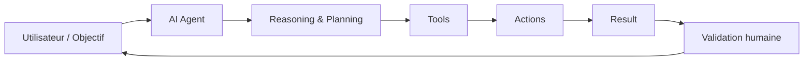

# IA, Productivité & AI Agents

## Transformer l'IA en véritable levier de travail

HashCode Workshop #01

<!--
TIME: 0:00–0:05
SAY: Cette séance ne porte pas sur les outils à la mode. Elle porte sur une question simple : comment produire plus de valeur avec moins de friction ?
-->

---

# Une question avant de commencer

## Sommes-nous vraiment plus productifs…

### …ou simplement plus occupés ?

Notifications. Réunions. Messages. Context switching. Outils. Tâches.

---

# Le problème

## Trop d'outils. Trop de tâches. Trop peu de temps.

La technologie devait réduire la friction.

Pourtant, beaucoup de professionnels passent leur journée à :

- chercher l'information ;
- reformuler les mêmes contenus ;
- changer constamment de contexte ;
- répéter des tâches prévisibles ;
- organiser le travail au lieu de faire avancer le travail.

> **Être occupé n'est pas la même chose qu'être productif.**

---

# Objectifs de la séance

À la fin de cet atelier, vous devrez pouvoir :

1. identifier les principales sources de friction dans votre travail ;
2. comprendre où l'IA apporte une vraie valeur ;
3. distinguer un assistant IA d'un AI Agent ;
4. concevoir un premier workflow augmenté par l'IA ;
5. imaginer un AI Agent utile pour un problème concret.

---

# IA : un amplificateur, pas une magie

## Humain + IA = capacité augmentée

L'IA est particulièrement utile pour :

- analyser ;
- résumer ;
- rechercher ;
- structurer ;
- générer une première version ;
- automatiser certaines tâches répétitives.

Mais elle ne remplace pas :

- le jugement ;
- la responsabilité ;
- la compréhension du contexte ;
- la validation.

> **L'objectif n'est pas d'utiliser plus d'IA. L'objectif est de créer plus de valeur.**

---

# Le modèle de productivité HashCode

## Identifier → Simplifier → Augmenter → Automatiser

### 1. Identifier
Où perdez-vous réellement du temps ?

### 2. Simplifier
Le processus est-il nécessaire ?

### 3. Augmenter
Comment l'IA peut-elle accélérer votre réflexion ou votre production ?

### 4. Automatiser
Quelles étapes répétitives peuvent être déléguées à un système ?

---

# Du chatbot à l'AI Agent

## Un assistant répond. Un agent agit.

**Assistant IA**

> Vous posez une question → il répond.

**AI Agent**

> Objectif → raisonnement → outils → actions → résultat → contrôle.

Un agent peut utiliser des outils, accéder à des informations et exécuter plusieurs étapes dans un workflow.

---

# Anatomie d'un AI Agent



> Un agent n'est pas seulement un chatbot avec un nouveau nom.

---

# Démonstration

## Transformer une tâche réelle

### Avant

```
Recevoir → Lire → Chercher → Résumer → Organiser → Répondre
```

### Après

```
Définir l'objectif → IA pour analyser → Validation → Action humaine
```

**Question :** quelle tâche de votre quotidien mérite d'être reconstruite ?

---

# Challenge #01

## AI Productivity Case

Choisissez une activité réelle que vous faites régulièrement.

Définissez :

- le problème ;
- les étapes actuelles ;
- le temps ou la friction ;
- ce que l'IA pourrait améliorer ;
- ce qui doit rester sous contrôle humain.

**Livrable :** un workflow « Before → After ».

---

# Workshop

## AI Agent Idea Card

Imaginez un agent spécialisé.

Complétez :

**Nom de l'agent**

**Mission**

**Utilisateur**

**Entrées**

**Outils nécessaires**

**Actions possibles**

**Résultat attendu**

**Limites et contrôle humain**

---

# Débrief

## Ce que nous retenons

- La productivité ne consiste pas à faire davantage de choses.
- Il faut supprimer la friction avant d'automatiser.
- L'IA augmente certaines capacités humaines.
- Les AI Agents deviennent intéressants lorsqu'ils peuvent utiliser des outils et agir dans un cadre défini.
- L'humain conserve la responsabilité des décisions importantes.

---

# Next Action

## Cette semaine

### Choisissez un seul workflow.

Pas dix.

Observez-le.

Simplifiez-le.

Puis utilisez l'IA pour l'améliorer.

> **Small workflow. Real problem. Measurable impact.**

# HashCode
## Identifie. Développe. Impacte.
